# BOLO — System Design

> **Version:** 3.0
> **Last updated:** 2026-06-14 — reconciled to `docs/product/prd.md` (BOLO Web PRD v1.0) + `docs/architecture/domain-model.md` + the Prisma schema.
> **Status:** Active. **Platform is now web-first** (mobile is a future phase, out of scope for V1).
> **Still open:** W64 (readiness indicators), W65 (routing approach — zero-router vs thin shell), W19 (org-role permission model). W63 resolved (2026-06-20): audit log IS in V1 — see schema V1.1. Provider selections (OTP, search, scheduler) are locked to AWS — see §10. All other open questions resolved — see `docs/product/open-questions-web-v1.md`.
> **Diagrams:** Mermaid — renders in VS Code, GitHub, Notion.

---

## 0. Frontend Interaction Model — Workspace-First Architecture

> **Source:** `Doc/Bolo Workspace Architecture v1.pdf` (client-provided, synced 2026-06-17). This **refines/supersedes** the routed-navigation framing in `prd.md` §13 and the "React Router / file-based routing" line previously in §2.1 below.

**Core model:** `Intent → Workspace`, not `Navigation → Page`. BOLO is one persistent, AI-powered workspace — not a set of pages the user clicks between.

**Five principles (client doc, verbatim intent):**
1. **Single Persistent Workspace** — every interaction (view assigned/delegated tasks, create a task, view notices, open stickies, search, view reports/evidence) renders inside one center canvas. The user never "leaves" the workspace.
2. **Global Voice Interface** — voice is always available, not tied to whatever is currently on screen. A command can switch the workspace to a different view regardless of current context (e.g. user viewing Assigned Tasks says "Show NBA readiness" → workspace switches to a readiness view; user viewing a Notice says "Create a task for Rohit" → workspace switches to task creation).
3. **Constant URL** — BOLO behaves like a single-page app; the URL should not change for primary workflows. Intended feel: "I am inside Bolo," not "I am inside the Tasks page."
4. **Workspace-First Rendering** — every action produces a **Workspace State**: Conversation, Task List, Task Detail, Evidence View, Notice View, Report View, Analytics View, Search Results, Approval Workflow. Only one primary state is active at a time; the canvas renders whichever state is active.
5. **Sidebars Are Context Providers, Not Navigation** — left/right panels surface context, shortcuts, filters, notifications, and suggestions. Clicking a sidebar item updates the active workspace state — it does **not** navigate to a new route/page.

**Layout structure (per client doc):**

| Region | Contents |
|---|---|
| Top Bar | Logo, search, readiness indicators, notifications, user profile |
| Left Panel (collapsible) | Assigned tasks, delegated tasks, labels, workspace shortcuts |
| Workspace Canvas | Dynamic content area — the primary interaction surface |
| Right Panel (collapsible) | Sticky notes, notices, AI suggestions, contextual information |
| Bottom Composer | Voice input, text input, live transcription — always present, not page-specific |

> "Readiness indicators" in the Top Bar implies a NAAC/NBA-style accreditation-readiness metric (Education vertical) not yet defined anywhere in `domain-model.md` or `prd.md` — flagged as new open question **W64** in `open-questions-web-v1.md`.

**Success metric (client's own framing):** a user should be able to complete an entire workday without feeling they've navigated across pages — the workspace should feel continuous, conversational, and context-aware.

**Implementation implications — flagged, not yet decided:**
- Conflicts with the current Architecture Rule in `CLAUDE.md` ("React Router for navigation — three-panel layout") and `prd.md` §13's sidebar-as-navigation framing. Both need updating once the technical approach below is confirmed.
- Open technical question: does "constant URL" mean **zero routing** (all state in a client store, e.g. Zustand — no React Router at all), or a **thin shell route** (one root route, workspace state held in memory or a URL query param for refresh-safety / shareable deep links)? Not yet decided.
- The existing sidebar nav items / five task tabs (`prd.md` §8.1, §13.1) are **not removed** — they're reframed as **workspace shortcuts that set workspace state**, not as routes.

---

## 1. High-Level Architecture

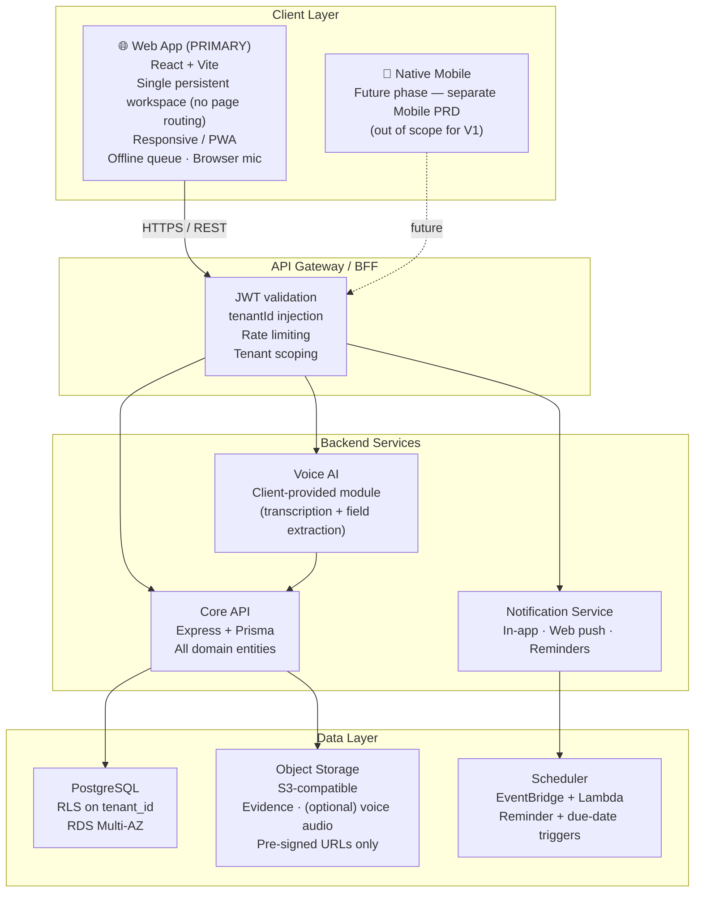

---

## 2. Component Breakdown

### 2.1 Client Layer

**Web App — React + Vite (PRIMARY build target, PRD §14)**
- Responsive web; runs in the browser on desktop and mobile. **PWA** is the interim option for offline + installability.
- **Responsive Web + desktop-installable PWA** both ship in V1; PWA is desktop-screen-scoped, no offline (W29 resolved).
- **No traditional page routing** — single persistent workspace, constant URL for primary workflows (see §0). Component library + Tailwind. Whether a router stays in the stack (zero-router vs thin shell) is still open — see §0 and W65.
- TanStack Query for server state, Zustand for local/UI state.
- **JWT storage:** httpOnly cookie, `SameSite=Lax`, `maxAge=7 days`, `Secure` via `COOKIE_SECURE` env var. W1 resolved. (Updated 2026-06-30 — was session cookie with SameSite=Strict; Strict blocked XHR from SPA, no maxAge caused token loss on browser close.)
- **Frontend data layer pattern (2026-06-30):**
  - `api/` files export **URL string constants only** (e.g. `TASKS_URL`, `LOGOUT_URL`) — no function exports.
  - `useFetch(method, url, params, options)` — URL-based signature; hooks pass the URL directly, not a service function reference.
  - `useConfigurableMutation({ url, method, onSuccess, onError })` — all mutations go through this.
  - Mock strategy: `VITE_USE_MOCKS=true` → hook passes mock data as `initialData` and sets `enabled: false`; no separate mock service functions.
  - All HTTP goes through `utils/apiServices.ts` (axios, `withCredentials: true`) — never raw `fetch` or `axios` in components/hooks.
- Offline mode: local write queue (IndexedDB / service-worker cache) + auto-sync on reconnect (see §7).
- **Mic:** browser microphone (Web Audio / `getUserMedia`), explicit permission prompt; a desktop-wrapped build would smooth this (PRD §14).

**Native Mobile (iOS / Android)**
- **Out of scope for V1** — separate Mobile PRD, future phase. Camera/GPS evidence capture returns with that phase.

---

### 2.2 API Gateway / BFF

Single Express app acting as BFF:
- Validates JWT on every request; rejects expired/invalid tokens.
- Injects `tenantId` from token into request context — never from request body.
- Applies rate limiting per user and per org.
- RBAC middleware runs per route — no exceptions.

---

### 2.3 Core API

REST API (Express + Prisma). Handles all domain entities:

| Domain | Entities |
|--------|----------|
| Tenant & Users | Tenant, Department, User, TenantMembership, OtpCode |
| Tasks | Task (subtasks are Tasks with `parentTaskId` set), Comment, Evidence, TaskPersonalLabel, VoiceRecording |
| Personal | StickyNote (a StickyNote with `dueAt` set = a Reminder — no separate entity, W30 resolved) |
| Organisation | ProjectLabel, BroadcastNotice, BroadcastAcknowledgement |
| Platform | Notification (in-app store), AuditLog |

> **Removed vs the old (mobile) design:** `Moment` / `MomentAppreciation` (Moments is out of scope, PRD §15); a separate `Subtask` table (now a self-referential `Task`); a dedicated `Reminder` entity (now `StickyNote.dueAt` — W30 resolved). **Added vs V1.0:** `OtpCode`, `TaskPersonalLabel`, `BroadcastAcknowledgement` (composite PK prevents double-ack at DB level; sender sees COUNT only — W33), `AuditLog` (W63 resolved, in V1).

Architecture is strict **Controller → Service → Repository**:
- Controller: HTTP only — parse request, call service, return response.
- Service: business logic only — no HTTP, no Prisma directly.
- Repository: DB only — the only place Prisma is called.

---

### 2.4 Voice AI Module

- **Scope: client-provided.** The client delivers the Voice AI module; we consume its structured output.
- **SDK owns live transcription, field extraction, and interpretation** (W4 resolved, 2026-06-17). We only receive the final `{ intent, entityType, operation, jsonBody }` — never raw audio.
- Languages per PRD §9.6: **Hindi + English (Hinglish supported)** as defaults; user sets a preferred language in profile; **cross-language task viewing is supported**. *(Provider and any additional languages — e.g. the previously-mentioned Sarvam AI / Marathi / Tamil — are carried from the old PRD and not re-confirmed for web.)*
- Our responsibility:
  1. Capture mic input (browser), show **real-time transcription in large fonts** (PRD §9.2).
  2. Accept the structured task draft; show a review form with missing required fields highlighted.
  3. On confirm (**click "Create Task"**, PRD §9.3) → call Core API.
- Voice is **unavailable offline** — mic disabled with "Voice unavailable offline" (PRD §9.5, §12.4).
- **Mic is context-aware, no panel restriction** — can create any entity from anywhere regardless of active panel (W7 resolved).

**Temporary audio storage during review (pre-confirm):**
The SDK returns `audioBlob` (raw bytes) alongside the structured JSON. During the review phase (user inspecting/fixing pre-filled fields), the blob lives in **React component state only** — nothing is uploaded to S3 or sent to the backend until the user clicks confirm. On cancel, the blob is discarded. IndexedDB is not used here: the review window is too short (seconds) to justify the complexity, and a tab crash during review is acceptable — user re-speaks (W5/W6).

**Two-phase voice save on confirm:**
DB transactions cannot be held open while waiting for S3 — S3 is external and uploads take seconds. The two phases are:
- **Phase 1 (synchronous, single DB transaction):** `POST /tasks` creates the `tasks` row and the `voice_recordings` row (transcript + metadata only, `audioUrl = null`) atomically. Returns 201 immediately.
- **Phase 2 (async, after 201, non-blocking for user):** frontend requests presign → PUTs blob to S3 → calls `PATCH /tasks/:id/voice-recording/audio { s3Key }` to set `audioUrl`. If phase 2 fails at any point, the task + transcript are intact; `audioUrl` stays null and `hasAudio = false`. An S3 lifecycle policy on `bolo-voice/` auto-deletes orphaned objects older than 24h (handles the case where S3 upload succeeded but the PATCH never arrived).

**Evidence is always post-creation and fully separate:** never part of any task creation transaction. The presign → S3 PUT → POST /evidence flow is independent and can happen at any time after the task exists.

---

### 2.5 Notification Service

Event-driven for immediate events (task assigned, commented, etc. — written inline by the API request that caused them). Scheduled for time-based events (reminders, due-date proximity, AI Nudge — see below). **In-app for all types; email additionally for reminder/due-date types and the AI Nudge escalation moment (corrected 2026-07-03/04 — was previously documented as in-app only across the board).**

| Channel | Status | Provider |
|---------|--------|----------|
| In-app (bell icon) | ✅ MVP | Core API + DB |
| Web push | ✅ MVP (desktop PWA confirmed — W29) | Web Push API / FCM-web |
| Reminders (scheduled) | ✅ MVP | EventBridge Scheduler + Lambda |
| Email | ✅ MVP, **scoped** — `TASK_REMINDER`/`TASK_DUE_*` (W71) and the one-time AI Nudge due-proximity escalation only (W77). All other types stay in-app only. | AWS SES via `@aws-sdk/client-ses` (same as OTP, decided 2026-07-18 — was nodemailer/SMTP) |
| WhatsApp | ❌ Out of scope (MVP) | — |

**Dispatch pattern — single entry point (resolved 2026-07-05):** every notification-creating call site (task lifecycle services, AI Nudge sweep, future scheduled jobs) goes through one function, `dispatchNotification()` (`bolo-backend/src/services/notification/dispatchNotification.service.ts`), instead of each service hand-rolling its own `NotificationRepository.create()` + email logic. Two reasons this exists rather than inlining at each call site:
1. **Config-driven channel behavior, one place to change it.** `src/config/notificationChannels.ts` is a static map of `NotificationType → { inApp, email }`, matching the channel table above exactly. Toggling email for a type means editing one line in one file, not hunting down every call site. **Hardcoded for V1** — same precedent as the AI Nudge sweep's own config constants (W74/75/77 below). A real feature-flag service (live toggle, no redeploy) is planned but explicitly deferred; this map is the interim.
2. **Fault isolation from business logic — the hard requirement.** The in-app write and the email send are two independent try/catches inside `dispatchNotification`; neither can throw back to the caller. A business action (accept task, cancel task, mark done, etc.) can never fail because a notification or email failed. A per-call `forceEmail` override exists for exceptions where the same `NotificationType` needs different channel behavior depending on context — e.g. `AI_NUDGE_DUE_PROXIMITY` is in-app-only on routine cycles but the one-time escalation-to-assigner moment needs email; the call site passes `forceEmail: true` for just that one dispatch rather than changing the type's default.

Callers still own their own email template/content (via a `sendEmail: () => Promise<void>` callback) — the dispatcher only decides *whether* to invoke it and isolates failure, it doesn't own template logic.

**Standing rule for all future API work (added 2026-07-05, also in root `CLAUDE.md`):** every new or changed service that alters task/subtask/broadcast state must check whether it needs a `Notification` — see the channel table above — and if so, wire it through `dispatchNotification()`, never a raw repository call or inline email logic. This isn't optional per-PR judgment; it's why the dispatcher exists.

**Due-date sweep (built 2026-07-05):** a second, separate scheduled job (`dueDateSweep.job.ts`, every 30 min — one-shot events don't need AI Nudge's 15-min cadence) covers the 4 remaining schema types that don't hang off any user action: `TASK_DUE_TODAY`, `TASK_DUE_TOMORROW`, `TASK_OVERDUE` (all in-app + email), and `REMINDER_FIRED` (in-app only, StickyNote.dueAt). Deliberately **not office-hours-gated** like AI Nudge — a task crossing into overdue is a factual event, not a discretionary nudge, and should be recorded whenever the sweep next runs regardless of time of day. Dedup is one-shot ("has this type ever fired for this entity" — no re-fire window, unlike AI Nudge's interval-based re-fire). This sweep is also currently the **only** code path that transitions a task's status to `OVERDUE` — nothing else in the codebase does this automatically, so `runOverdue()` updates status and fires the notification together, atomically in sequence. **Known gap:** if a Draft task later gets a `dueDate` added via `updateTask` (promoting it to `OPEN`), `TASK_ASSIGNED` still doesn't fire for that path — only `createTask`'s initial-creation path does (see changelog.md 2026-07-05).

**Notification events:** the canonical list is in `prd.md` §10 / `domain-model.md`. There is no "task rejected" event — rejection is not in V1.

**Broadcast fan-out:** enqueued, never inline — a broadcast to a large dept must not block the API response.

**Frontend delivery — decoupled from backend generation (clarified 2026-07-04):** the client has one generic polling loop (`GET /notifications?isRead=false`, configurable interval) that's completely independent of *how* or *when* the backend created any given `Notification` row. This means the backend scheduler cadence and the frontend poll cadence are two independent numbers that don't need to match.

---

### 2.6 Audit Log Service — Generic Middleware, Not a Dispatcher (added 2026-07-14, W98/W99)

Deliberately the **opposite pattern from §2.5's Notification dispatcher.** `dispatchNotification()` requires every call site to explicitly report an event; `AuditLog` instead uses one global middleware (`src/middleware/auditLog.middleware.ts`, registered once in `index.ts` next to `requestLoggerMiddleware`/`metricsMiddleware`) that observes every mutating request generically — **no service or controller calls an audit function directly**, with one documented exception below.

**Why the opposite pattern from Notifications:** a `Notification` needs hand-written, context-specific `message`/`actorName`/`entityTitle` content that only the business service has on hand — inlining that content-building into a generic layer isn't possible. An `AuditLog` row needs none of that; it's a mechanical `{who, what route, before-state, after-state}` capture that's fully derivable from the HTTP request/response and a DB read, which is exactly what a generic middleware is good at. Choosing the dispatcher pattern here (one call per service) was rejected specifically to satisfy "don't touch every service that needs auditing" — the actual build requirement, not just a style preference.

**Mechanics:**
1. **Route config table** (`src/config/auditRouteConfig.ts`, one static file, same spirit as `notificationChannels.ts`) — one row per `{method, route pattern}` → `{ entityType (UPPERCASE, W95), model (Prisma model name), idParam, action | resolveAction(before, after) }`. A route not in this table is never audited — adding a new mutating endpoint means adding one config row, not editing a handler.
2. **Before-state**: for UPDATE/DELETE-shaped routes, the middleware does a generic `prisma[model].findUnique({ where: { id } })` before calling `next()`. Naturally `null` for CREATE routes (matches the schema's existing "before is null for creates" convention).
3. **After-state**: the middleware wraps `res.json` to capture the response body's `data` field (every controller already responds via `successResponse()` → `{ success, message, data }`, so this needs no per-controller change). Only fires the audit write when `res.statusCode < 400`.
4. **Action resolution**: most routes are single-purpose (`POST /tasks/:id/accept` → `TASK_ACCEPTED`, `POST /tasks/:id/cancel` → `TASK_CANCELLED`, etc.) and just need a static action in the config row. The one generic catch-all, `PATCH /tasks/:id`, needs a `resolveAction(before, after)` diff function — checks `assigneeId` → `TASK_REASSIGNED`, `status DRAFT→OPEN` → `TASK_ASSIGNED`, other `status` change → `TASK_STATUS_CHANGED`, `priority`/`dueDate`/label fields → their respective actions, in that priority order (mirrors `updateTask.service.ts`'s own mutually-exclusive branching, reimplemented as a field-diff rule table instead of read from the service's internal booleans).
5. **Write**: fire-and-forget (W96) — the audit write happens after the response has already been sent (not awaited inline), wrapped in try/catch, logged on failure, never affects the request.

**The one exception — login/logout (W99):** `verifyOtpService` writes nothing to the `User` row on login, and `logout.controller.ts` made zero DB calls at all — there's no entity mutation for the generic middleware to observe. Resolved by adding `User.lastLoginAt`/`User.lastLogoutAt` (see `domain-model.md`), set by those two flows for their own legitimate session-tracking purpose; the middleware then picks up `USER_LOGIN`/`USER_LOGOUT` the same generic way as everything else. This required giving `logout` a real service/repository layer for the first time (previously controller-only). No `dispatchAuditLog()`-style call was added anywhere — the exception is a schema/business-field change, not an audit-specific code path.

**Known scope gap (W97, non-blocking):** `api-spec.md` §12 lists `STICKY_NOTE`/`PROJECT_LABEL` as `entityType` filter values, but neither has `AuditAction` enum coverage or config rows yet — those filters currently return nothing. Resolve before building `GET /audit-log`'s filter validation.

**Evidence + Profile Picture (2026-07-18, PR #36):** 4 config rows added — `POST /tasks/:id/evidence` → `DOCUMENT_UPLOADED`, `DELETE /tasks/:id/evidence/:eid` → `DOCUMENT_DELETED` (`entityType: 'DOCUMENT'`, `model: 'evidence'`), `PATCH`/`DELETE /me/profile-picture` → `USER_PROFILE_UPDATED` (`entityType: 'USER'`, `entityIdFromActor: true` — same self-referential shape as login/logout, no id anywhere in the path). Real bug caught by unit-verifying the matcher against the actual route strings before shipping, not by `tsc`: `/tasks/:id/evidence`'s only path param is named `:id` but refers to the **task**, not the new evidence row — the default `idParam: 'id'` would have silently resolved `entityId` to the task's id instead of the evidence's. Fixed with an explicit `idParam` override pointing at a param name absent from that route, forcing the intended response-body fallback. `AuditLog.entityType` gained a `DOCUMENT` value — `GET /audit-log`'s filter enum and `api-spec.md`/`swagger.ts` updated to match; `DOCUMENT` rows are TOP-only for now (`findEntityAssignerId()` doesn't resolve Evidence → Task → assignerId — a possible follow-up, not implemented). Live-verified failure paths only (no AWS credentials in the dev sandbox that built this): all 4 confirmed to produce zero audit rows on a failed request (404/500), validating the status-gate; success-path (real S3 upload → confirm → audit row) needs verification in an environment with real credentials.

**Build order:** (1) route config table + generic middleware, tested against Task's full route set (widest surface — covers most `AuditAction` values via single-purpose routes plus the one diff-based catch-all); (2) `User.lastLoginAt`/`lastLogoutAt` migration + the two auth-flow edits; (3) `GET /audit-log` read endpoint; (4) config rows for Broadcast/Evidence once those routes exist (currently commented out in `routes/index.ts`).

**Platform-admin extension (2026-07-17):** the superadmin feature (cross-tenant tenant/member management, `routes/platformAdmin.routes.ts`) shipped with 4 services calling `AuditLogRepository.log()` directly — a method that never existed, since it's exactly the manual-call pattern this design avoids. Rather than adding a `.log()` method as a second exception alongside login/logout (which would make "the one exception" no longer true), the generic middleware itself was extended to support a **second actor source**:

- `AuditRouteRule.actorSource?: 'user' | 'platformAdmin'` (default `'user'`) — platform-admin routes authenticate via `req.platformAdmin` (`requirePlatformAdmin` middleware), not `req.user`. `PlatformAdmin` isn't a `User` row, so there's no valid FK target for `AuditLog.actorId` — it's always `null` for these, with `actorType: PLATFORM_ADMIN` distinguishing "an admin did this, identity not FK-traceable" from a normal user action.
- `AuditRouteRule.tenantIdParam?: string` — platform admins have no tenant of their own, but `AuditLog.tenantId` is required; resolved from the *target* tenant instead, either a path param (`:tenantId`, most routes) or the response body (`POST /platform-admin/tenants`, the create-tenant route, which has no `:tenantId` in its path since the tenant doesn't exist yet).
- `AuditRouteRule.entityIdResponseField?: string` (default `'id'`) — platform-admin controllers return `{ tenantId }`/`{ userId }`, not `{ id }`; the entityId-from-response-body fallback (used for creates) needed a configurable field name instead of an assumed `'id'`.

All 4 manual `AuditLogRepository.log()` calls were removed from the platform-admin services (`createTenant`/`addMember`/`removeMember`/`bulkImportMembers`.service.ts) — they no longer know auditing exists, matching every other service in the codebase. `AuditActorType.PLATFORM_ADMIN` and the 4 new `AuditAction` values (`TENANT_CREATED`/`MEMBER_ADDED`/`MEMBER_REMOVED`/`MEMBERS_BULK_IMPORTED`) had already been added to the schema by the platform-admin PR — no migration was needed for this fix, only the middleware/config extension. Live-verified all 4 routes against the real DB.

**AI Nudge scheduler architecture — redesigned 2026-07-06, built 2026-07-10 (2 types, not 3; office hours removed):** one shared scheduler rule (15-min tick, `aiNudgeSweep.job.ts`) invokes `runAiNudgeSweep()`, which evaluates both remaining AI Nudge trigger conditions each run:
1. **Follow-up** (Task + Subtask, **5 conditions**, own 6h gap, runs continuously — no office-hours gate): (a) not accepted, (b) accepted-no-progress, (c) unanswered comment, (d) `DONE_A` awaiting `DONE_D` confirmation (assigner-facing), (e) all subtasks `DONE_D` but parent open (assigner-facing). One condition fires per task per tick (first match wins, priority order a→e — a task rarely matches more than one simultaneously, this just breaks ties). Each condition dedup-checked independently per-recipient; each tracks its own skip counter in `NudgeSkipCounter` but **enforces no cap** — none of the 5 ever escalates.
2. **Due-proximity** (Task/Subtask, StickyNote, **and Broadcast — added 2026-07-06**), own 3h gap, runs continuously: dedup-check against the re-fire interval (per-recipient — see below) → notify. **Skip is a user-clicked button** (`POST /nudges/:id/skip`), not something the sweep auto-increments on firing — the sweep only *reads* the counter to decide escalation, it never writes to it. Each tick, independent of whether the routine notification itself re-fires: if the recipient's skip count has reached the cap (3 due-today / 1 overdue for Task/Subtask) and it hasn't already escalated and the task hasn't reached `DONE_A` → escalate to the assigner (one-time in-app+email, `NudgeSkipCounter.escalatedAt` guards against repeats). For Broadcast: same shape, cap of 3, **but exceeding it only removes the Skip affordance — no escalation, no notification to the sender**; one row per (broadcast, un-acknowledged recipient) pair, resolved via a `TenantMembership` audience-resolution query (dept/role filters, null = everyone). For StickyNotes: no cap at all, just stops matching once the due date's calendar day ends.

**Periodic is retired — removed from the `NotificationType` enum entirely** (not just deprecated), as of migration `20260709182552_nudge_skip_counter_and_periodic_retirement`. It was a batched, per-user "you have N open tasks" summary with no per-task action. Once Follow-up gained per-task action buttons (Accept/Add Comment/Mark Complete) and lost its own skip-cap, there was no remaining structural difference between the two types — Follow-up's 5 named conditions already comprehensively cover what Periodic vaguely summarized. Do not reintroduce.

**Office-hours gating removed entirely.** Was 9am–6pm IST; assumed a single institution's business hours, which doesn't generalize across BOLO's multiple verticals, timezones, or individual login/usage patterns. The sweep now runs 24/7 — each type's cadence is purely its own elapsed-time gap (Follow-up 6h → ~4 fires/day; Due-proximity 3h → ~8 fires/day). **Known consequence, accepted:** Task due-proximity's caps (3/1) were originally sized assuming ~3 fires/day inside a 9h window; at 8 fires/day across 24h, the cap now exhausts same-day, within a few hours rather than over a full day — in practice, an overdue task (cap 1) starts at last-chance immediately, with zero grace skips. Matches "overdue is urgent," just faster than the original model assumed. Exact per-user configurable scheduling is a future feature-flag-service item — times stay as hardcoded constants for now.

All intervals/caps are **configurable constants in code, not admin UI, for the initial build.**

**Cross-type dedup, keyed on recipient+entity not just type (W84, corrected 2026-07-10):** before creating a `Notification` row, check whether *any* `AI_NUDGE_*` type already fired for this same `recipientId`+`entityType`+`entityId` within the cooldown window (`NotificationRepository.findMostRecentAiNudgeForRecipientAndEntity`). **Recipient-scoped, not just entity-scoped** — caught during the Phase 1 build: an entity-only check would let one Broadcast recipient's nudge suppress the notification for every other recipient of that same broadcast, since one Broadcast entity has many recipients. Applies uniformly across both remaining types.

**`entityType` distinguishes Subtask from Task (fixed 2026-07-10):** a Subtask is a `Task` row with `parentTaskId` set, not a separate table — but nudge/notification rows stamp `entityType: 'subtask'` vs `'task'` based on that flag (`parentTaskId ? 'subtask' : 'task'`), consistently across notification creation, dedup lookup, and the skip counter's key. This must stay consistent everywhere a Task-shaped entity is nudged, or a subtask's rate-limiting/skip-cap silently breaks (a subtask's nudges would either never dedup correctly, or read/write the wrong `NudgeSkipCounter` row).

**Skip counters — schema built 2026-07-10 (W94 resolved).** `Task.dueProximitySkipCount`/`dueProximityEscalatedAt` are gone. Replaced by a generic `NudgeSkipCounter` table keyed on `(userId, entityType, entityId, nudgeKind)` — note `userId` in the key, not just `entityType`+`entityId` as originally proposed: without it, Broadcast's many-recipients-per-entity shape would mean every recipient shares one counter. Also carries `tenantId` for RLS. See `domain-model.md` row 8c/8d for the full shape and `docs/api/api-spec.md` §11 for the `GET /nudges` / `POST /nudges/:id/skip` / `POST /nudges/skip-all` endpoints built on top of it.

**Nudge panel UI (2026-07-06, backend built 2026-07-10):** single unified list, two independent filters (Type: All/Follow-up/Due-proximity; Entity: All/Task/Subtask/StickyNote/Broadcast). Blocking while unresolved Due-proximity items exist (Follow-up never blocks). `Skip All` bulk-skips everything skippable at once, disabled while any item is at last-chance — enforced both client-side (button disabled) and server-side (`POST /nudges/skip-all` rejects with `409` if any item is at last-chance, since a client-side-only rule isn't trustworthy on its own). The `GET /nudges` feed re-validates every row against current entity state on every call and auto-resolves (marks read) anything whose underlying condition no longer holds — never trusts what was true when the notification originally fired.

---

### 2.6 Data Layer

**PostgreSQL**
- Primary datastore. Multi-tenant via **Row-Level Security on `tenant_id`** (locked direction).
- Single deployment — no per-org databases.
- Every tenant-scoped table has: `id` (UUID), `tenant_id` (UUID, NOT NULL, indexed), `created_at`, `updated_at`.
- `tenantId` injected from JWT by API middleware — never from request body.

**Object Storage (S3-compatible)**
Three S3 buckets (or prefixes within one bucket):

| Bucket | Contents | Access pattern |
|---|---|---|
| `bolo-evidence` | Task/subtask evidence files | Pre-signed GET URL generated **on demand** (15 min TTL) — assigner + assignee only |
| `bolo-voice` | Voice audio clips (opt-in) | Pre-signed GET URL generated **on demand** (15 min TTL) — assigner + assignee only |
| `bolo-broadcast` | Broadcast notice images | Pre-signed GET URL generated **once at publish time** (25h TTL) — stored in DB, returned directly in feed |

**Why broadcast images are different:** they render inline in the notice feed (no click). Generating a per-request URL for every image in a feed of 10 broadcasts would mean 10 extra API calls per page load. Instead, a single 25h URL is generated at publish and stored — the feed returns it directly from the DB row.

**Evidence constraints:** 25 MB per-task aggregate cap; images + documents allowed; no count limit (W25/W69 resolved). No GPS metadata on web.

**Voice audio:** opt-in (W37); retention 6 months–1 year (W41); encryption at rest if easily achievable else defer (W44).

**Orphan-safe upload pattern (all three buckets):**
All uploads land in an `unconfirmed/` prefix first. The confirmation API call does CopyObject → DeleteObject → DB write. S3 lifecycle rule: delete `unconfirmed/` objects after 24h. Raw S3 keys never returned in API responses.
```
bolo-evidence/unconfirmed/{tenantId}/{taskId}/{evidenceId}/{filename}      → confirmed: bolo-evidence/{tenantId}/...
bolo-voice/unconfirmed/{tenantId}/{taskId}/voice.webm                      → confirmed: bolo-voice/{tenantId}/...
bolo-broadcast/unconfirmed/{tenantId}/{broadcastId}/{filename}             → confirmed: bolo-broadcast/{tenantId}/...
Lifecycle on all three: prefix=unconfirmed/ | delete after 24h
```
Weekly EventBridge reconciliation job handles the rare edge case where copy+delete succeeded but DB write failed (confirmed-path orphan).

---

## 3. Task State Machine

Definitive states/transitions per **PRD §6** (same rules apply to a task and to a subtask). **There is no rejection state — W-C1.**

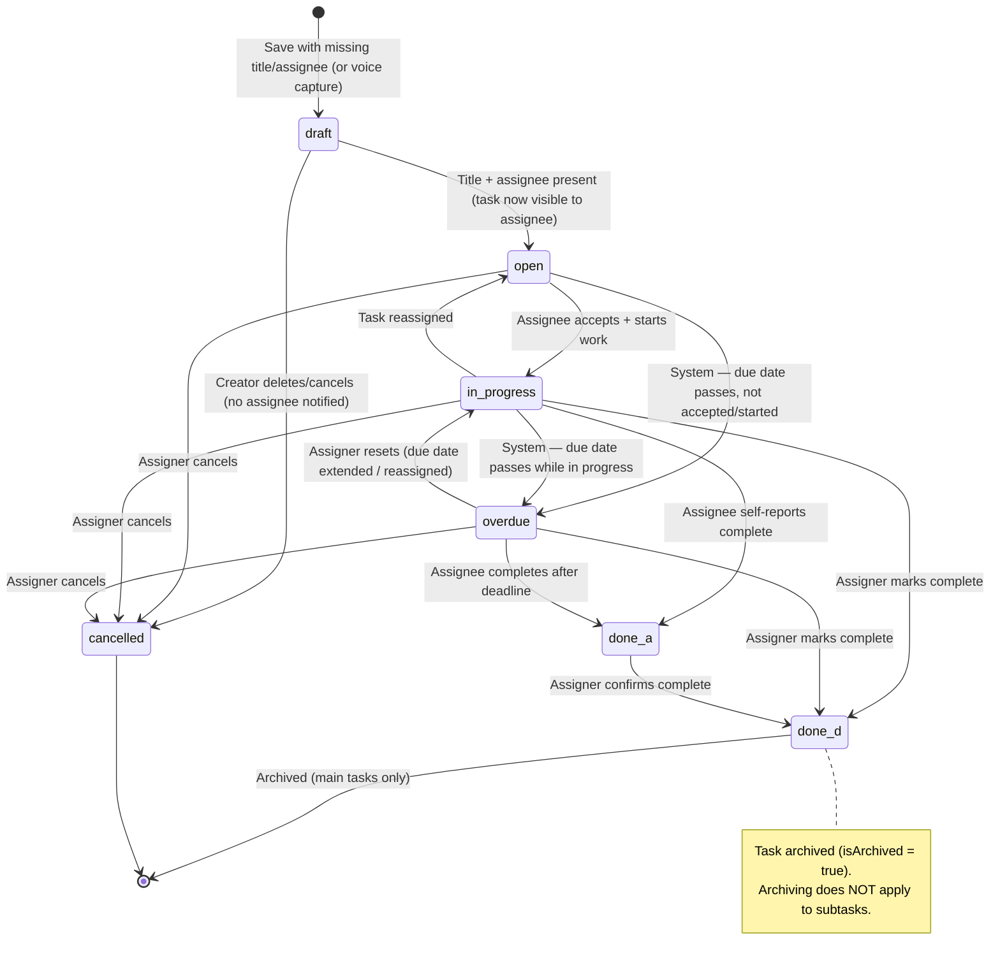

> System sub-states **Due Today / Due Tomorrow** are surfaced while `in_progress` (status indicators), alongside escalation event #8/#9.

**Rules enforced in the service layer (PRD §5, domain-model):**
- `title` — immutable after creation (task and subtask).
- Re-assign — blocked once any subtask exists.
- A main task can reach `done_d` only when **all subtasks are complete**.
- Parent `cancelled` → all subtasks auto-cancelled.
- `status` changeable by assigner only (except `done_a`, set by assignee).
- Subtask creation — parent task's **assignee** only; subtask assigner = parent's assignee.
- Archive only when `parentTaskId IS NULL`.
- **Required fields for `draft → open`: Title + Assignee + Due Date** (W-C3 resolved, 2026-06-17). A Draft can be saved missing any of these.

---

## 4. Key Feature Flows

### 4.1 Task Creation — Two Paths (web)

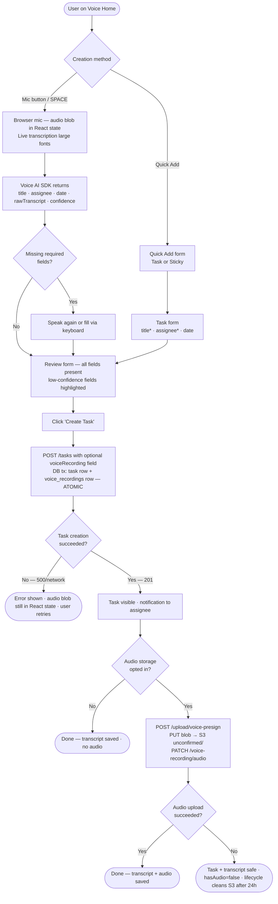

---

### 4.2 Evidence Upload Flow (web) — Happy Path + Failures

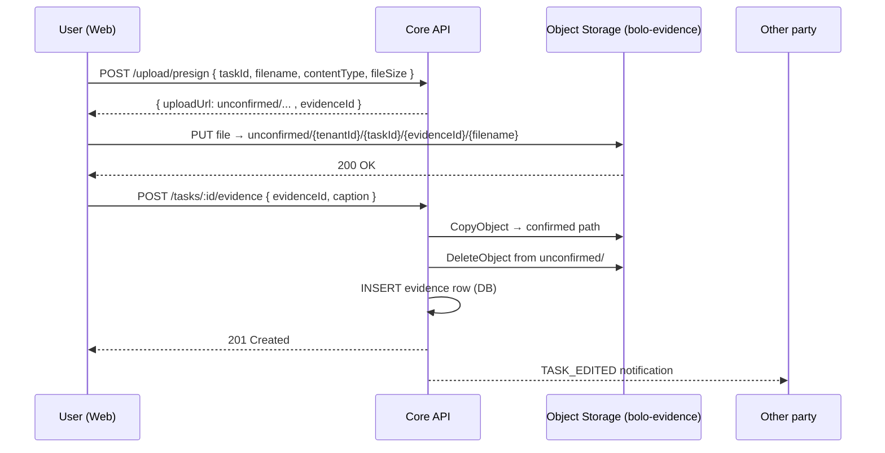

**Failure scenarios:**

| Fails at | S3 state | DB state | Recovery |
|---|---|---|---|
| PUT to S3 | Nothing in S3 | No row | User retries upload. Clean. |
| CopyObject | `unconfirmed/` only | No row | S3 lifecycle deletes `unconfirmed/` after 24h. Task unaffected. |
| DeleteObject | Both `unconfirmed/` + confirmed | No row | Lifecycle cleans `unconfirmed/`. Confirmed copy is orphan → weekly reconciliation. |
| INSERT evidence row | Confirmed path only | No row | Orphan in confirmed path → weekly reconciliation deletes it. |

> No GPS/geotag on web (no device location API in V1).
> Access: pre-signed GET URL generated **on demand** (15 min TTL) — assigner + assignee only. Raw S3 key never returned.

---

### 4.3 Auth Flow (Email OTP, web)

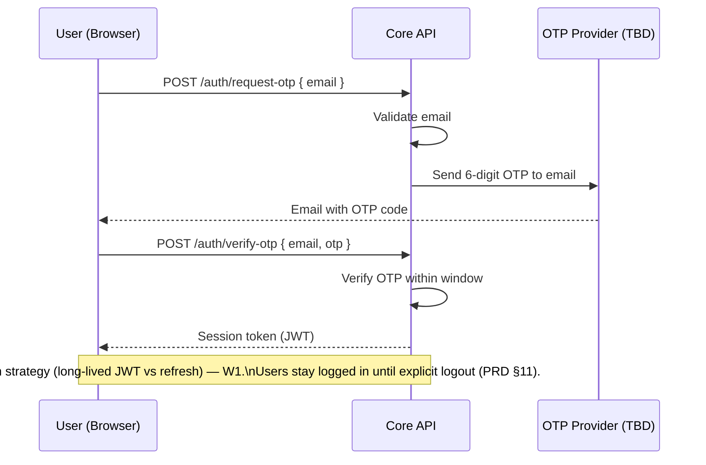

---

### 4.4 Offline Mode Flow (PWA)


> Offline-available: view/create/update tasks, sticky notes CRUD, create broadcast (stays Draft until sync). Unavailable: voice, push, directory lookup, global search (PRD §12).

---

### 4.5 Broadcast Notice Flow

```mermaid
flowchart LR
    A([HoD / Dean]) --> B[Notice editor\nmessage + optional image]
    B --> C[Set audience\nDept + Role level]
    C --> D[Publish]
    D --> E[Server: generate 25h pre-signed URL\nstore in imageUrl · set expiresAt]
    E --> F[(Saved · expires 24h)]
    F --> G[Fan-out job enqueued]
    G --> H[In-app notification\nto recipients in scope]
    H --> I([Notice on landing page\nimage renders inline — no click needed])
    I --> J[If requiresAcknowledgement:\nrecipient taps Acknowledge]
    J --> K([Sender sees read count only — no per-person breakdown])
```

> Broadcast permissions: governed by a binary "can broadcast" flag per user — not by org-role level (W22 resolved). Char limit: ~200 characters (W31 resolved). Expiry: fixed at 1 day, not configurable (W54 resolved).

---

### 4.6 Voice Recording Upload Flow — Happy Path + Failures

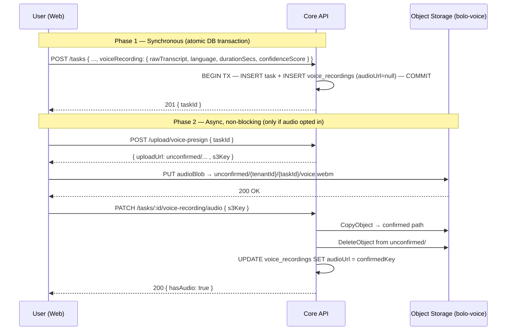

**Failure scenarios:**

| Fails at | Task | Transcript | Audio | Recovery |
|---|---|---|---|---|
| POST /tasks | ❌ | ❌ | Never touched | Blob in React state. User retries. Clean. |
| PUT to S3 | ✅ | ✅ | Nothing in S3 | `hasAudio = false`. Task fully usable. |
| CopyObject | ✅ | ✅ | `unconfirmed/` only | Lifecycle deletes after 24h. `hasAudio = false`. |
| DeleteObject | ✅ | ✅ | Both paths | Lifecycle cleans `unconfirmed/`. Confirmed = orphan → weekly reconciliation. |
| UPDATE audioUrl | ✅ | ✅ | Confirmed orphan | Weekly reconciliation deletes orphan. `hasAudio = false`. |

> In every failure case: **task and transcript are always safe**. Audio loss is acceptable — transcript is source of truth (W39).
> Access: pre-signed GET URL generated **on demand** (15 min TTL) — assigner + assignee only.

---

### 4.7 Broadcast Image Upload Flow — Happy Path + Failures

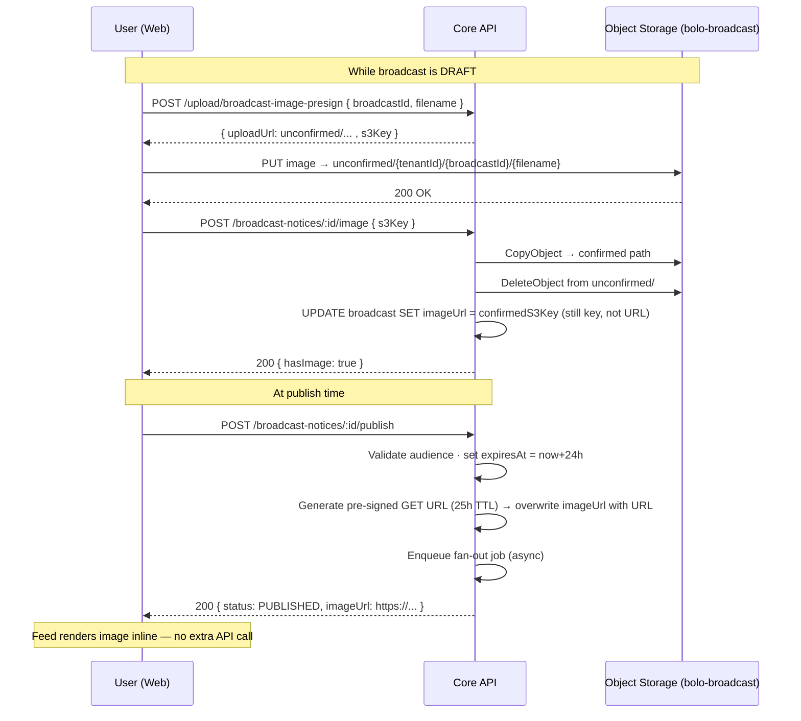

**Failure scenarios:**

| Fails at | Broadcast | Image | Recovery |
|---|---|---|---|
| PUT to S3 | Draft intact | Nothing in S3 | User retries. Clean. |
| CopyObject | Draft intact | `unconfirmed/` only | Lifecycle deletes after 24h. No image attached. |
| DeleteObject | Draft intact | Both paths | Lifecycle cleans `unconfirmed/`. Confirmed = orphan → weekly reconciliation. |
| UPDATE imageUrl (draft) | Draft intact | Confirmed orphan | Weekly reconciliation. User re-attaches. |
| Publish fails | Still DRAFT | S3 key in DB | User re-publishes. Pre-signed URL regenerated. |

**Why image serving differs from evidence/voice:**

| | Evidence / Voice Audio | Broadcast Image |
|---|---|---|
| User action to see | Click to open / play | Renders inline automatically |
| URL TTL | 15 min — generated on demand per request | 25h — generated once at publish, stored in DB |
| Why | Private — access-controlled per request | Public to audience — no per-request cost acceptable for feed |

---

### 4.3 Auth Flow (Email OTP, web)


---

### 4.4 Offline Mode Flow (PWA)

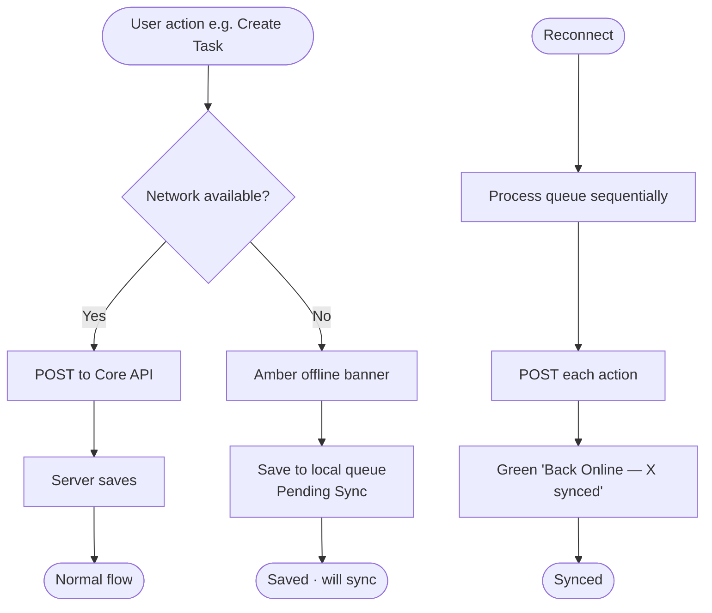

> Offline-available: view/create/update tasks, sticky notes CRUD, create broadcast (stays Draft until sync). Unavailable: voice, push, directory lookup, global search (PRD §12).

---

### 4.5 Broadcast Notice Flow

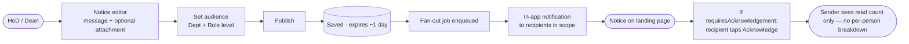

> Broadcast permissions: governed by a binary "can broadcast" flag per user — not by org-role level (W22 resolved). Char limit: ~200 characters (W31 resolved). Expiry: fixed at 1 day, not configurable (W54 resolved). HoD / Dean audience targeting per PRD §7.1.

---

## 5. Entity Relationship Diagram

> **Schema V1.1 + VoiceRecording — 16 tables** (15 locked 2026-06-20; `VoiceRecording` added 2026-06-27 per design session). `prisma/schema.prisma` pending migration in dev session.

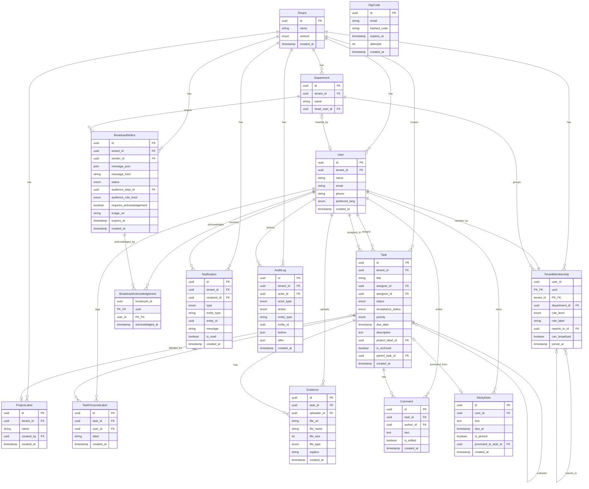

> `Notification` and `AuditLog` use polymorphic references (`entity_type` string + `entity_id`) — no hard FK, one table covers all entity types. `BroadcastAcknowledgement` is a separate join table with composite PK `(broadcast_id, user_id)` — prevents duplicate acknowledgements at DB level; sender sees COUNT only (W33 resolved). `StickyNote.due_at` set = reminder — no separate Reminder entity (W30 resolved). `OtpCode` rows are cleaned up by EventBridge sweep every 15 min (no Redis needed at MVP scale).

---

## 6. Multilingual Support

- All UI strings externalised via i18n from Sprint 1 — no hardcoded strings.
- Defaults: **Hindi + English (Hinglish supported)**; user sets preferred language in profile (PRD §9.6).
- **Cross-language task viewing is supported** (PRD §9.6 — note: this reverses the old "post-MVP" position).
- Voice AI language handling owned by the client module (W4).
- Library: `i18next` + `react-i18next` (web).

---

## 7. Offline Mode (PWA)

| Scenario | Behaviour |
|----------|-----------|
| Server unreachable | Amber "Offline Mode" banner, sticky below header, non-dismissible until online (PRD §12.2) |
| Voice commands | Disabled — "Voice unavailable offline" |
| Reads | Served from TanStack Query cache |
| Writes (task create/update, sticky CRUD, broadcast draft) | Saved to local queue, marked Pending Sync |
| Reconnect | Queued actions auto-sync in order; green "Back Online — X synced" |
| Conflict | "Conflict" state requires manual resolution — UI **undefined, W34** |

**Implementation:** TanStack Query read cache + a service-worker / IndexedDB write queue (web). On reconnect, process queue sequentially and surface conflicts.

---

## 8. Authentication & Authorisation

**Auth (Email OTP — PRD §11):**
```
User enters email → API validates → OTP provider sends 6-digit code (TBD)
→ user enters code within window → API issues session token (JWT)
→ user stays logged in until explicit logout
```
Token strategy (long-lived vs refresh rotation), SSO/"Sign in with Google" — **W1 / W2**.

**JWT payload:**
```json
{
  "userId": "uuid",
  "tenantId": "uuid",
  "orgRoleLevel": "top | mid | executor",
  "departmentId": "uuid"
}
```

**RBAC enforcement:**
- Org-level standing is `top | mid | executor` (Dean/HoD/Faculty or Director/HoD/Employees). Task-level roles (Delegator/Assignee) are derived per task, not stored.
- Assignment is **any-to-any — no hierarchy enforcement** (W17/W18/W20 resolved). W19 (binary broadcast-permission model vs 3-tier role) is confirmed per Rhushabh but worth one explicit re-confirm before schema changes.
- RBAC middleware on every route checks `tenantId + userId` (+ role where relevant). Never trust role from the body.

**Tenant isolation:** Row-Level Security on `tenant_id`; middleware injects `tenantId` into every query; asserted in every PR.

---

## 9. Performance Targets

| Metric | Target |
|--------|--------|
| Task list load (P95) | < 300 ms |
| Task create | < 500 ms |
| Voice-to-draft task | text loads ASAP; audio/files may take longer (Q67) |
| Notification delivery (in-app) | < 2 s |
| Evidence upload (25 MB) | Best effort — progress shown |
| Concurrent users at launch | 100 → 1,000 (Q65) |
| Uptime SLA | TBD — W53 (99.9% vs 99.5%) |

**Strategies:** paginate all lists (default 20, max 100); `tenant_id` indexed on every table; no N+1; evidence bypasses API via pre-signed URLs; broadcast fan-out queued.

---

## 10. Infrastructure

**Cloud: AWS ap-south-1 (Mumbai)** — India latency + data residency.

| Component | Service | Notes |
|-----------|---------|-------|
| Compute | EC2 (t3 family) | No Kubernetes for MVP |
| Database | RDS PostgreSQL Multi-AZ | Primary datastore |
| Object storage | S3 | Evidence files; optional voice audio |
| Search | AWS OpenSearch | Keyword/voice search; PostgreSQL `tsvector` fallback if small. Search scope — W24 |
| Scheduler | EventBridge Scheduler + Lambda | Reminder + due-date triggers |
| Web push | Web Push API / FCM-web | Desktop PWA confirmed (W29) — in scope V1; native FCM/APNs deferred with mobile |
| Load balancer | ALB | HTTPS termination |
| CI/CD | GitHub Actions | Lint → typecheck → test → build → deploy |
| Monitoring | CloudWatch + Sentry | Errors, latency, infra metrics — **prod backend still open, see §10.1 / W70** |

**Environments:** `dev` → `staging` → `production`. See `docs/ops/deployment.md`.

---

## 10.1 Observability Architecture (producer implemented 2026-07-01)

> **Note (2026-07-01, API versioning):** routes now mount under `/api/v1` (was `/api`) — `src/index.ts` does `app.use('/api/v1', routes)`, and `routes/index.ts`'s internal prefixes were updated to drop the redundant `/api` (e.g. `/tasks` not `/api/tasks`). `GET /health` moved to `GET /api/v1/health`. Not part of the observability work — a separate versioning change made alongside it.
>
> **Tenant-wise API usage tracking (2026-07-01):** `requestLogger.middleware.ts`'s `customProps` now enriches the `request completed` log line with `tenantId`/`userId`/`roleLevel` (from `req.user`, populated by `requireAuth` before completion) and the normalized `route` pattern (e.g. `/tasks/:id/accept`, from `req.route`, not the raw resolved URL). One enriched log line now answers "which tenant hit which API how many times, with what status" — same cardinality-avoidance principle as tenant-level metrics: this lives in Loki (queried via LogQL `| json`), not as a new Prometheus label. Verified against 2 seeded test tenants with mixed 200/201/400/404 responses — dashboard queries (hit counts, failure counts, p95 latency per tenant) all confirmed matching the exact generated traffic.
>
> **Status: fully verified end-to-end (2026-07-01), including the full dev stack.** Producer (logging + metrics + tracing middleware) built, type-checked, built, and verified against a real local Postgres. `docker compose up` run for the full dev stack (postgres/backend/prometheus/loki/jaeger/alloy/grafana) — confirmed a real request's logs land in Loki (queryable via LogQL `| json`), metrics land in Prometheus (via Alloy's scrape + remote-write), and a **full multi-span trace** lands in Jaeger (Express auto-instrumentation breaks down every middleware — cors, jsonParser, cookieParser, metricsMiddleware, the route handler — as its own child span, richer than initially expected). All 3 datasources auto-provisioned in Grafana. **Scope note:** Prisma auto-instrumentation (`@prisma/instrumentation`) was dropped — incompatible OpenTelemetry SDK version with the pinned Prisma 5.22.0 (see `docs/ops/deployment.md`); Prisma queries do not appear as spans, only as a non-trace-correlated debug log line. **5 real bugs found and fixed only by actually running the stack** (not caught by type-check/build) — see `changelog.md` 2026-07-01 "Dev stack verified end-to-end" entry: port 5432 conflict, `Dockerfile` CMD pointing at the wrong entry file, duplicate Prometheus scrape config, unlabeled Loki logs, and `pino-pretty` fragmenting logs in the container.

**Principle: decouple what the app emits (producer) from where it's stored (backend).** The app emits logs/metrics/traces in open, vendor-neutral formats; a single agent (Grafana Alloy) decides where they go. This means dev and prod can run the exact same app code — only Alloy's output config differs per environment. See `tech-playbook/decisions/backend.md` for the full WHY and `tech-playbook/patterns/observability-stack.md` for the reusable pattern.

### Layers

| Layer | What | Where |
|---|---|---|
| **Producer** (in `bolo-backend`) | `pino` + `pino-http` (structured JSON logs), `prom-client` (Prometheus-format metrics on `GET /metrics`), `@opentelemetry/sdk-node` (auto-instrumented traces — Express + Prisma) | One global middleware stack, registered once in `index.ts`. No per-controller changes. |
| **Correlation** | A single `requestId`/`traceId` generated by the first middleware in the chain (or read from incoming `traceparent` header), attached to every log line, span, and metric exemplar for that request | `middleware/observability/requestContext.middleware.ts` |
| **Agent** | Grafana Alloy — single collector process. Tails stdout for logs, scrapes `/metrics`, receives OTLP trace spans, forwards to **one backend per environment** (Alloy is technically capable of fanning out to more than one destination at once, but BOLO deliberately keeps it to a single backend per env — simpler ops, one place to look). | Runs alongside the app (sidecar container in dev/prod) |
| **Backends** | Loki (logs), Prometheus (metrics), Jaeger (traces) | **Dev: self-hosted Grafana stack via `docker-compose`** (see `docs/ops/deployment.md`) — locked. **Prod: open question — W70**, a single choice between the Grafana stack or AWS CloudWatch + Sentry, not both. |
| **Dashboard** | Grafana — single UI, correlates logs/metrics/traces by `traceId` (Explore → click a metric spike → jump to the matching log lines → jump to the full trace waterfall) | Dev only for now; prod dashboard depends on the W70 answer |

### Why this doesn't touch every existing endpoint
Logging, metrics, and trace context are **global middleware** — adding them is ~5 lines in `index.ts`, not a change to all 20+ existing controllers. Database call tracing comes free via Prisma auto-instrumentation. The only per-file change needed is `middleware/error.middleware.ts` (attach `traceId` to the error log, redact PII) and the `/api` skill's Controller template (log via the request-scoped logger instead of `console.error`).

### Sample flow — `POST /api/v1/tasks`

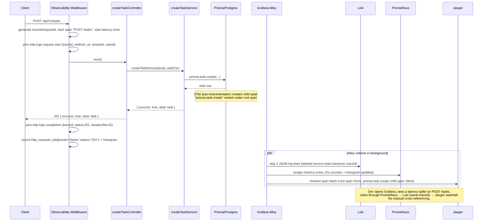

### Phased plan
1. **Now (planning):** architecture + decision recorded (this section, `tech-playbook/decisions/backend.md`, `tech-playbook/patterns/observability-stack.md`).
2. **Backend implementation session:** build `middleware/observability/` (request context + pino logger + prom-client metrics route + OTel bootstrap), wire into `index.ts`, update `error.middleware.ts`, update `/api` skill's Controller template.
3. **Local dev stack:** add Prometheus + Loki + Jaeger + Grafana + Alloy services to `bolo-backend/docker-compose.yml`, provision Grafana datasources + a starter dashboard. See `docs/ops/deployment.md`.
4. **Prod backend decision (deferred — W70):** stay on locked CloudWatch + Sentry, migrate fully to self-hosted Grafana stack on EC2/OpenShift, or use Grafana Cloud. Producer code doesn't change regardless of the answer — only Alloy's prod config does.
5. **Later:** alerting (Grafana Alerting or Prometheus Alertmanager) — not scoped yet.

---

## 11. Security Requirements (summary — full checklist in `docs/ops/security.md`)

| Requirement | V1 Status |
|-------------|-----------|
| HTTPS everywhere | ✅ Must |
| Tenant isolation (tenant_id RLS) | ✅ Must from Sprint 1 |
| Pre-signed URLs for file access | ✅ Must |
| MIME type + file size validation (server-side) | ✅ Must |
| Rate limiting per user + org | ✅ Must |
| No PII in logs (email, task content, voice) | ✅ Must |
| Encryption at rest for PII (voice) | ❌ Not in V1 (W44) |
| Audit log | ✅ In V1 — AuditLog table in schema V1.1 (W63 resolved 2026-06-20) |
| DPDP Act compliance | ❌ Deferred to V2 (W62) |
| Account deletion / right to erasure | ✅ Must (W57) |

> GPS PII controls dropped from V1 — no device location on web.

---

## 12. Scalability Notes

- Multi-tenant RLS scales to hundreds of orgs on a single DB.
- Voice AI is client-operated and stateless per request.
- Broadcast fan-out queued (large dept = many notifications).
- Evidence uploads bypass the API server — S3 handles throughput.
- EventBridge + Lambda for reminders/due-dates scales to many scheduled events.

---

## 13. Out of Scope (MVP)

- Native mobile apps — iOS/Android (separate Mobile PRD).
- Moments / Moment appreciation.
- Template marketplace / predefined templates (V2.0).
- WhatsApp notifications. Email notifications for reminder/due-date types (`TASK_REMINDER`, `TASK_DUE_TODAY`, `TASK_DUE_TOMORROW`, `TASK_OVERDUE`) **are in scope** (corrected 2026-07-03) — all other notification types remain in-app only.
- Escalation engine — **there is none**. AI Nudge (due-date proximity + periodic triggers) replaces it entirely (W23/W48–W52 resolved).
- PII encryption at rest (W44); DPDP compliance (W62).
- Analytics dashboards (definition pending — W26–W28).
- Whiteboards, Evidence Vault, Academic Calendar.
- Multi-org user accounts (separate emails = separate users — W56).
